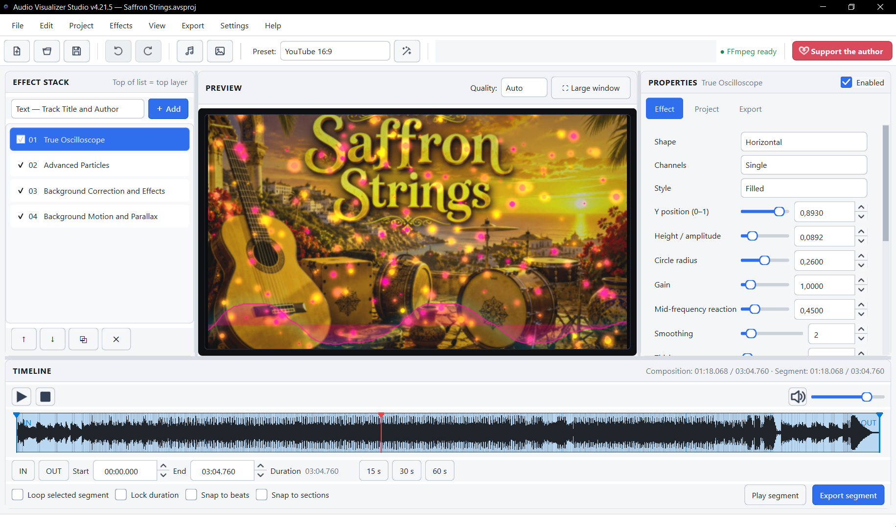
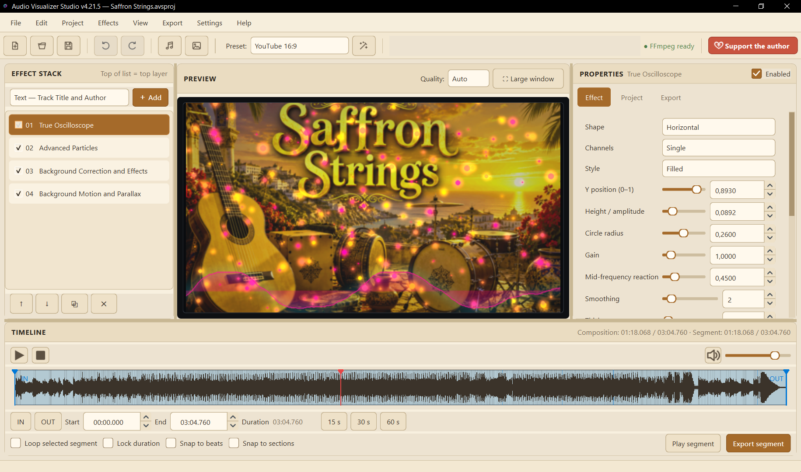
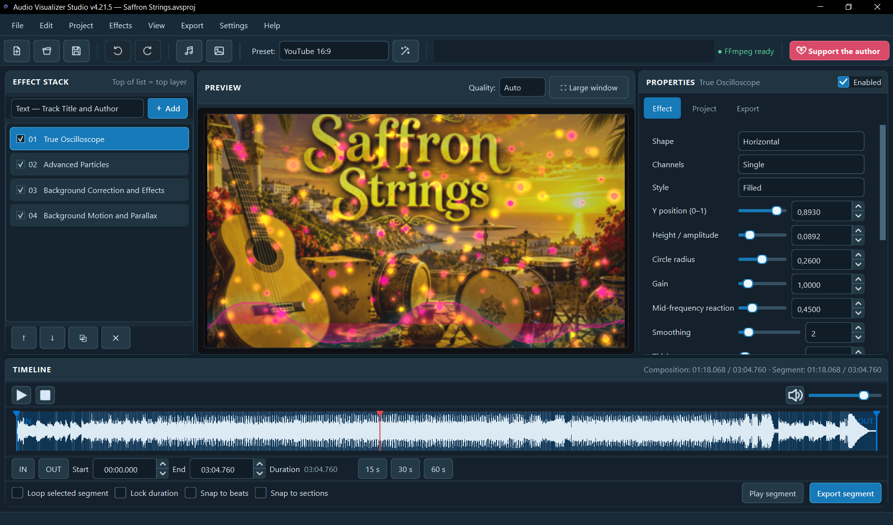
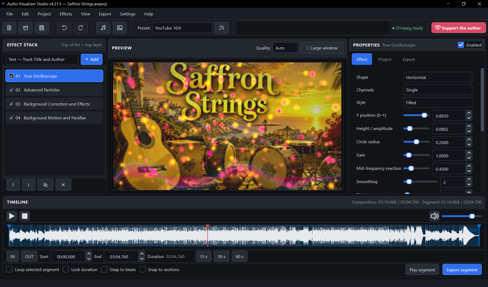

# Audio Visualizer Studio

**English** | [Українська](README_UA.md)

**Audio Visualizer Studio** is a free Windows application for creating visualizations for your music. Take an MP3 or WAV file, add a background image, configure the effects, and upload the finished video to YouTube or social media.

The application features multilayer effects, real-time preview, a timeline, image and subtitle support, and video export powered by FFmpeg.

[](https://github.com/arnoldovich/audio-visualizer-studio/releases/latest)
[](#system-requirements)
[](#license)

### [[Support the Author and the Development of the Application]](https://donatello.to/arnoldovich)
Support is voluntary and does not affect the availability of any features.

## Download

The latest stable version is available on the following page:

### [Download Audio Visualizer Studio](https://github.com/arnoldovich/audio-visualizer-studio/releases/latest)

In the **Assets** section, select:

Audio_Visualizer_Studio_Setup_4.21.5.exe

Do not download the automatically generated GitHub files `Source code (zip)` or `Source code (tar.gz)`—they do not contain the application installer.

## Key Features

- Create audio-reactive music visualizations.
- Multilayer stack of visual effects.
- Composition preview.
- Waveform timeline with audio navigation.
- Configurable video resolution, frame rate, and quality.
- MP4 export using H.264 and H.265 codecs.
- Software and hardware encoding support.
- Background and center images.
- Subtitle support.
- Ready-made presets for landscape and portrait videos.
- Quick test export of a short segment.
- Ukrainian and English localizations.
- Light, dark, ocean blue, and sand themes.
- Automatic project saving.
- Local audio analysis cache.
- Bundled FFmpeg and FFprobe.

## System Requirements

- Windows 10 or Windows 11.
- 64-bit operating system.
- Approximately 650 MB of free disk space for installation.
- Additional space for audio files, projects, and rendered videos.
- At least 8 GB of RAM is recommended.

Preview and export performance depends on your processor, graphics card, selected resolution, frame rate, and number of effects.

## Installation

1. Open the [latest release](https://github.com/arnoldovich/audio-visualizer-studio/releases/latest) page.
2. Download the `.exe` installer from the **Assets** section.
3. Run the downloaded file.
4. Select the installer language.
5. Read and accept the license agreement.
6. Follow the setup wizard instructions.
7. Launch the application from the Start menu or the desktop shortcut.

The application is installed for the current user and normally does not require administrator privileges.

You do not need to install Python, FFmpeg, or other libraries separately—the required components are included in the distribution.

## Windows SmartScreen Warning

The installer does not currently have a commercial digital signature. As a result, Windows SmartScreen may display the following message:

> Windows protected your PC

To continue with the installation:

1. Click **More info**.
2. Verify the installer filename.
3. Click **Run anyway**.

Download the application only from the official Releases page of this repository.

## Verifying the Downloaded File

An SHA-256 checksum is published for each release. It allows you to verify that the installer has not been corrupted or modified.

You can verify the file in PowerShell with the following command:

```powershell
Get-FileHash -Algorithm SHA256 ".\Audio_Visualizer_Studio_Setup_4.21.5.exe"
```

SHA-256 checksum for the version 4.21.5 installer:

```text
9C6F846A68359493036866448A03D65AC52F286732E188AD9EBABF44F8745198
```

## Screenshots

<p align="center">
  <a href="screenshots/Main-page-Light.png">
    
  </a>
  <a href="screenshots/Main-page-Sand.png">
    
  </a>
  <a href="screenshots/Main-page-OceanBlue.png">
    
  </a>
  <a href="screenshots/Main-page-Midnight-Black.png">
    
  </a>
</p>

## Uninstalling the Application

You can remove the application using the standard Windows tools:

1. Open **Settings**.
2. Go to **Apps → Installed apps**.
3. Find **Audio Visualizer Studio**.
4. Click **Uninstall**.

You can also use the uninstaller located in the application's installation directory.

## License

Audio Visualizer Studio is distributed as proprietary **freeware**.

The application may be used free of charge for personal, educational, and commercial purposes in accordance with the license agreement.

The source code is not published. This repository is used to distribute official installers and announce new releases.

The distribution includes:

- the main Audio Visualizer Studio license;
- a list of third-party components;
- third-party library license texts;
- information about FFmpeg and other components.

## Support Development

If you find the application useful, you can support its continued development:

### [Support via Donatello](https://donatello.to/arnoldovich)

Support is voluntary and does not affect the availability of any features.

## Author

Copyright © 2026 **arnoldovich**.  
All rights reserved.
